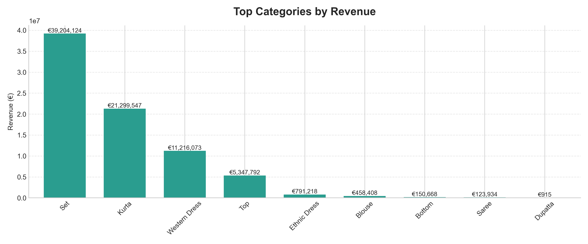

# 📊 E-commerce Sales Analysis (Amazon)

This project analyzes Amazon sales data to uncover revenue trends, product performance, and differences between domestic and international markets.

---

## 🎯 Objective

To transform raw, inconsistent e-commerce data into a clean, unified dataset and extract insights that can support business decisions.

---

## ⚙️ Approach

- Cleaned and standardized multiple sales datasets  
- Handled missing values and inconsistent formats  
- Merged domestic and international sales into a single dataset  
- Performed exploratory data analysis to identify key trends  

---

## 🛠️ Tech Stack

- Python  
- Pandas  
- NumPy  
- Matplotlib / Seaborn  

---

## 📈 Key Insights

- Sales show clear variation over time, with identifiable monthly trends  
- Certain product categories consistently outperform others in both revenue and volume  
- International sales contribute a meaningful share of total revenue  
- A small number of SKUs account for a large portion of total sales (long-tail effect)  

---

## 📊 Analysis Performed

- Monthly sales trends  
- Product category performance  
- Domestic vs international comparison  
- SKU-level revenue vs volume analysis  

---

## 📦 Output

- Clean, analysis-ready dataset  
- Visualizations highlighting key trends and comparisons  

---

## 💡 What This Demonstrates

- Data cleaning and transformation across multiple sources  
- Handling real-world messy datasets  
- Exploratory data analysis (EDA)  
- Communicating insights clearly through visuals  

---

## 📷 Example Visuals

  
  
